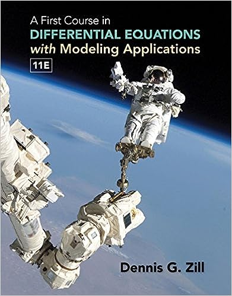

Welcome to the homepage of in-person **Math F302 Differential Equations** for Fall 2023.

### Instructor

[Ed Bueler](http://bueler.github.io/) is in the [Dept. of Mathematics and Statistics](http://www.uaf.edu/dms/) at the [University of Alaska Fairbanks](http://www.uaf.edu/).

### Canvas Website

Log in to [canvas.alaska.edu/courses/16214](https://canvas.alaska.edu/courses/16214) for Homework and Exam solutions, to see your grades, and recorded lectures.

### Getting Started

* Attend lectures: MWF 10:30-11:30am, Gruening 408.

* Read the [syllabus](assets/general/F23/syllabus.pdf).

* See the [schedule](assets/general/F23/schedule.pdf).  Go there often to find out what happens next.

* See the [daily materials](daily.html) tab, for slides and worksheets.  Zoom recordings of the lectures are Announcements on the [Canvas website](https://canvas.alaska.edu/courses/16214).

* [Homework](homework.html) is assigned by section of the textbook, and you will need to turn it using [Gradescope](https://canvas.alaska.edu/courses/16214) by 11:59pm on the due date.  See the [schedule](assets/general/F23/schedule.pdf) for due dates.  Get to [Gradescope via the Canvas site](https://canvas.alaska.edu/courses/16214).

* [Quizzes](quizzes.html) and [Exams](exams.html) happen on Wednesdays.  See the [schedule](assets/general/F23/schedule.pdf).

### Important Links

* [Watch this 3blue1brown "tour of differential equations" video](https://www.youtube.com/watch?v=p_di4Zn4wz4)

* if you [solve this ridiculously hard partial differential equation problem](https://www.claymath.org/millennium/navier-stokes-equation/) about fluids then you get $1 million, but on the other hand every [fluids scientist or engineer takes for granted that they can solve that same problem very accurately if not exactly](https://www.youtube.com/watch?v=iKAVRgIrUOU)

* [Bueler's office hours](http://bueler.github.io/OffHrs.htm)

### Textbook

Dennis G. Zill, _A First Course in Differential Equations with Modeling Applications_, 11th ed., 2018 (ISBN-13: 978-1337604994)

---
_Site design derived from [coordinated Calc I](https://uaf-math251.github.io/), an original [Jekyll](https://jekyllrb.com/) design by [David Maxwell](https://damaxwell.github.io/)._

